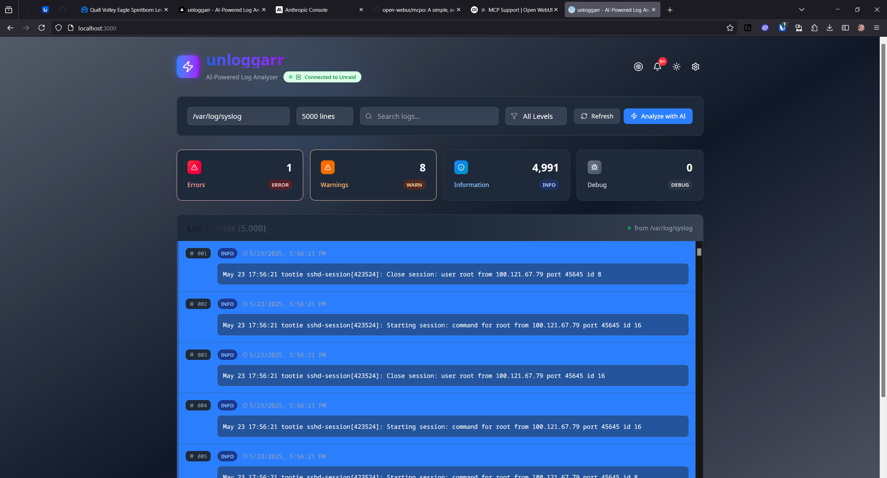

# 🚀 unloggarr

AI-Powered Log Analyzer for Unraid servers with beautiful modern UI, built with Next.js 15, AI SDK 5 Alpha, and TypeScript.

## 📸 Screenshots



*The beautiful modern interface with enhanced UI components, dark theme support, and AI-powered analysis capabilities.*


*AI-powered log analysis with streaming results, token usage statistics, and cost tracking using Anthropic Claude 3.5 Sonnet.*

## ✨ Features

### 🎨 **Beautiful Modern Interface**
- **Enhanced Visual Design** - Stunning gradient cards, micro-interactions, and polished components
- **Dark/Light Theme** - Sophisticated theming with smooth transitions and improved contrast
- **Advanced Animations** - Smooth hover effects, loading skeletons, and delightful micro-interactions
- **Professional Statistics** - Beautiful stat cards with icons, gradients, and interactive filtering

### 📊 **Powerful Log Management**
- **Real-time Log Viewing** - Seamless connection to MCPO (MCP Orchestrator) for live log streaming
- **Smart Filtering** - Advanced filtering by log level with visual feedback and clickable statistics
- **Intelligent Search** - Real-time search with highlighted results and contextual suggestions
- **Multiple Log Sources** - Access all Unraid log files via MCPO (syslog, docker, plugins, diagnostics, etc.)
- **Large Dataset Support** - Optimized for viewing 5000+ log lines with smooth scrolling

### 🤖 **AI-Powered Analysis**
- **Intelligent Log Analysis** - Advanced AI analysis using Anthropic Claude 3.5 Sonnet
- **System Health Insights** - Comprehensive health assessments and trend analysis
- **Error Pattern Recognition** - Automatic detection of critical issues and recurring problems
- **Actionable Recommendations** - Smart suggestions for system optimization and issue resolution

### 🔔 **System Integration**
- **Real-time Notifications** - Live Unraid system notifications with priority indicators
- **Scheduler Management** - Built-in scheduler control for automated analysis and Gotify alerts
- **Gotify Integration** - Automated analysis summaries and critical alerts via Gotify notifications
- **Connection Status** - Real-time connection monitoring with visual indicators
- **Automated Workflows** - Schedule periodic analysis with intelligent notification delivery
- **Responsive Design** - Optimized for desktop, tablet, and mobile devices

## 🛠️ Setup

### Prerequisites

- Node.js 18+ and pnpm
- Anthropic API key (for AI analysis feature)
- Unraid server with MCPO (MCP Orchestrator) installed and running
- Network access to your Unraid server and MCPO endpoint

### Installation

1. **Clone and install dependencies:**
   ```bash
   git clone <your-repo>
   cd unloggarr
   pnpm install
   ```

2. **Set up environment variables:**
   ```bash
   cp .env.local.example .env.local
   ```
   
   Add your Anthropic API key to `.env.local`:
   ```env
   ANTHROPIC_API_KEY=your_anthropic_api_key_here
   ```
   
   Get your API key from: https://console.anthropic.com/

3. **Start development server:**
   ```bash
   pnpm dev
   ```

4. **Configure MCPO connection:**
   Ensure your MCPO server is running and accessible at the configured URL (default: http://localhost:6970)
   The MCP server endpoint will be available at: `http://localhost:6970/mcp-unraid`

5. **Open your browser:**
   Navigate to `http://localhost:3000`

## 🔌 MCPO Integration

unloggarr connects to MCPO (MCP Orchestrator) to access your Unraid system logs and data:

### 📋 **MCPO Requirements**
- **MCPO Server** - Must be installed and running on your Unraid system
- **Network Access** - unloggarr needs network connectivity to MCPO endpoint
- **Authentication** - Valid MCPO authentication token required
- **Port Access** - Default MCPO port 6970 must be accessible

### ⚙️ **MCPO Configuration**
1. **Install MCPO** - Follow MCPO installation instructions for your Unraid system
2. **Configure Authentication** - Set up authentication tokens in MCPO
3. **Network Setup** - Ensure MCPO is accessible from unloggarr deployment
4. **Test Connection** - Verify connectivity using MCPO health endpoints
5. **Configure Integration** - Update `mcpo-config.json` with your MCPO server details

### 🔍 **Supported MCPO Features**
- **Log Streaming** - Real-time access to all Unraid log files
- **System Monitoring** - Access to system status and health information
- **Notification Integration** - Real-time Unraid notifications
- **Multi-source Logs** - Access to syslog, docker logs, plugin logs, and more

## 🔄 Data Flow Architecture

Understanding how data flows through unloggarr's components helps with troubleshooting and system optimization:

### 🏗️ **Component Architecture**

```
┌─────────────────┐    ┌─────────────────┐    ┌─────────────────┐    ┌─────────────────┐
│   Web UI        │◄──►│      MCPO       │◄──►│   MCP Server    │◄──►│   Unraid        │
│   (unloggarr)   │    │  (Orchestrator) │    │ (/mcp-unraid)   │    │    System       │
└─────────────────┘    └─────────────────┘    └─────────────────┘    └─────────────────┘
```

### 📊 **Data Flow Steps**

#### 1. **Web UI → MCPO**
- **Protocol**: HTTP/HTTPS REST API calls
- **Endpoint**: Configured via `MCPO_BASE_URL`
- **Authentication**: Standard HTTP authentication
- **Data**: User requests for logs, analysis, notifications, system status

#### 2. **MCPO → MCP Server**
- **Protocol**: Model Context Protocol (MCP) over HTTP
- **Endpoint**: `http://localhost:6970/mcp-unraid` (default)
- **Authentication**: MCP session management
- **Data**: Translated tool calls and resource requests

#### 3. **MCP Server → Unraid**
- **Protocol**: Unraid API calls, file system access, system commands
- **Authentication**: Direct system access (containerized security)
- **Data**: Log files, system stats, notifications, configuration

#### 4. **Response Flow** (Reverse path)
- **Unraid** → **MCP Server**: Raw system data
- **MCP Server** → **MCPO**: Structured MCP responses
- **MCPO** → **Web UI**: JSON formatted data for frontend consumption

### 🔧 **MCPO REST API Endpoints**

MCPO exposes REST endpoints that translate to MCP tool calls:

#### **Log Management**
```bash
GET    /api/logs                    # List available log files
GET    /api/logs/{file}?lines=5000  # Fetch log entries
POST   /api/logs/analyze            # Trigger AI analysis
```

#### **System Monitoring**
```bash
GET    /api/system/status           # System health status
GET    /api/system/notifications    # Unraid notifications
GET    /api/system/metrics          # Performance metrics
```

#### **Scheduler & Automation**
```bash
GET    /api/scheduler/status        # Scheduler status
POST   /api/scheduler/control       # Start/stop scheduler
GET    /api/scheduler/history       # Analysis history
```

### 📚 **API Documentation**

#### **Swagger Documentation**
Access comprehensive API documentation at:
```
http://your-unraid-ip:6970/docs
```

The Swagger interface provides:
- **Interactive Testing** - Test API endpoints directly from the browser
- **Request/Response Examples** - See expected data formats
- **Authentication Testing** - Validate your MCPO auth tokens
- **Schema Documentation** - Complete data models and types

#### **MCP Server Documentation**
View MCP-specific tool documentation at:
```
http://your-unraid-ip:6970/mcp-unraid/tools
```

#### **Common Issues & Solutions**

1. **Web UI can't reach MCPO**:
   ```bash
   # Check MCPO connectivity
   curl -H "Authorization: Bearer YOUR_TOKEN" http://your-unraid-ip:6970/api/status
   ```

2. **MCPO can't reach MCP Server**:
   ```bash
   # Check MCP server endpoint
   curl http://your-unraid-ip:6970/mcp-unraid/health
   ```

3. **MCP Server can't access Unraid**:
   ```bash
   # Check Unraid API access
   curl http://your-unraid-ip:6970/mcp-unraid/tools/test-unraid-connection
   ```


### 🔐 **Security & Data Privacy**

#### **Data Flow Security**
- **Web UI ↔ MCPO**: TLS encryption, bearer token authentication
- **MCPO ↔ MCP Server**: Internal network communication, session tokens
- **MCP Server ↔ Unraid**: Direct system access with containerized isolation

#### **Data Retention**
- **Logs**: Fetched on-demand, not permanently stored in unloggarr
- **Analysis Results**: Stored locally in browser session/local storage
- **Metrics**: Basic performance monitoring, no sensitive data retention


## 🐳 Docker Deployment

For production deployment, use the included Docker setup that provides a complete log analysis solution with beautiful UI and MCPO integration:

### Quick Start with Docker Compose

1. **Clone the repository:**
   ```bash
   git clone <your-repo>
   cd unloggarr
   ```

2. **Create environment file:**
   ```bash
   cp .env.local.example .env.local
   ```
   
   Configure your `.env.local` file:
   ```env
   # AI Analysis (REQUIRED for analysis features)
   ANTHROPIC_API_KEY=your_anthropic_api_key
   
   # Unraid Configuration (REQUIRED)
   UNRAID_API_URL=https://your-unraid-ip/graphql
   UNRAID_API_KEY=your_unraid_api_key
   UNRAID_VERIFY_SSL=false
   
   # MCPO Configuration (REQUIRED)
   MCPO_BASE_URL=http://unloggarr-mcpo:8000/unraid-mcp
   
   # Optional Integrations
   GOTIFY_URL=https://gotify.example.com
   GOTIFY_TOKEN=your_gotify_token
   UNLOGGARR_SCHEDULE=0 * * * *
   ```

3. **Deploy with Docker Compose:**
   ```bash
   docker-compose up -d
   ```

4. **Access the application:**
   - **Web UI:** http://localhost:3000
   - **Health Check:** http://localhost:3000/api/health
   - **API Endpoints:** http://localhost:3000/api/*

### Manual Docker Build

```bash
# Build the image
docker build -t unloggarr .

# Run the container
docker run -d \
  --name unloggarr \
  -p 3000:3000 \
  -e ANTHROPIC_API_KEY=your_anthropic_key \
  -e UNRAID_API_URL=https://your-unraid-ip/graphql \
  -e UNRAID_API_KEY=your_unraid_api_key \
  -e MCPO_BASE_URL=http://unloggarr-mcpo:8000/unraid-mcp \
  -e GOTIFY_URL=https://gotify.example.com \
  -e GOTIFY_TOKEN=your_gotify_token \
  -v ./logs:/app/logs \
  unloggarr
```

### Container Features

- 🏗️ **Multi-stage build** for optimized image size and fast deployment
- ⚡ **Next.js optimization** with production builds and static optimization
- 🔧 **Graceful shutdown** handling with proper cleanup
- 📊 **Built-in health checks** for container monitoring and orchestration
- 📝 **Persistent storage** for logs, themes, analysis history, and user preferences
- 🔄 **Auto-restart** policies for high availability
- 📅 **Integrated scheduler** for automated analysis and Gotify notifications
- 🤖 **Background processing** for scheduled AI analysis and alert generation
- 🎨 **UI asset optimization** with efficient caching and compression

### Environment Variables

| Variable | Description | Default |
|----------|-------------|---------|
| `ANTHROPIC_API_KEY` | Anthropic API key for AI analysis (required) | - |
| `MCPO_BASE_URL` | MCPO server base URL (required) | `http://unloggarr-mcpo:8000/unraid-mcp` |
| `UNRAID_API_URL` | Unraid server GraphQL endpoint | `https://192.168.1.100/graphql` |
| `UNRAID_API_KEY` | Unraid API key for system access | - |
| `UNRAID_VERIFY_SSL` | SSL certificate verification | `false` |
| `GOTIFY_URL` | Gotify server URL for notifications (optional) | - |
| `GOTIFY_TOKEN` | Gotify application token (optional) | - |
| `UNLOGGARR_SCHEDULE` | Cron schedule for automated analysis | `0 * * * *` |
| `UNRAID_MCP_PORT` | MCP server port | `6970` |
| `UNRAID_MCP_HOST` | MCP server host binding | `0.0.0.0` |
| `UNRAID_MCP_LOG_LEVEL` | MCP server logging level | `INFO` |

## 🤖 AI Log Analysis

Powered by Anthropic Claude 3.5 Sonnet, our AI analysis provides deep insights into your Unraid system health:

### 🎯 **Intelligent Analysis Features**
- **🏥 System Health Assessment** - Comprehensive evaluation of overall system status
- **🚨 Critical Error Detection** - Automatic identification and prioritization of critical issues
- **⚠️ Warning Pattern Analysis** - Recognition of recurring warnings and their implications
- **🔍 Root Cause Analysis** - Deep investigation into problem sources and dependencies
- **💡 Actionable Recommendations** - Specific, prioritized steps to resolve identified issues
- **📈 Trend Analysis** - Historical pattern recognition and predictive insights
- **🔧 Performance Optimization** - Suggestions for system performance improvements

### 🚀 **Enhanced Analysis Experience**
- **Real-time Processing** - Streaming analysis with live progress indicators
- **Context-Aware Insights** - Analysis tailored to your specific log selection and filters
- **Token Usage Tracking** - Transparent cost monitoring and optimization
- **Export & Share** - Save analysis results for future reference
- **Interactive Results** - Clickable insights that jump to relevant log entries

Simply click the **"Analyze with AI"** button to get comprehensive, actionable insights about your current log selection. The AI considers your applied filters and search terms to provide targeted analysis.

## 📅 Automated Analysis & Gotify Integration

unloggarr supports automated log analysis with intelligent notifications via Gotify:

### 🤖 **Scheduled Analysis**
- **Automated Processing** - Runs AI analysis on a configurable schedule (hourly, daily, weekly)
- **Smart Filtering** - Automatically analyzes recent logs for critical issues and patterns
- **Adaptive Scheduling** - Adjusts analysis frequency based on log activity and error rates
- **Historical Tracking** - Maintains analysis history and trends over time

### 📲 **Gotify Notifications**
- **Real-time Alerts** - Instant notifications for critical issues and system health changes
- **Summary Reports** - Periodic analysis summaries with key insights and recommendations
- **Priority Levels** - Smart notification prioritization based on issue severity
- **Rich Formatting** - Beautiful formatted notifications with actionable insights

### 🔧 **Configuration Options**
```env
# Gotify Integration
GOTIFY_URL=https://gotify.example.com
GOTIFY_TOKEN=your_gotify_application_token

# Scheduling Configuration
UNLOGGARR_SCHEDULE=0 * * * *   # Every hour (cron format)
```

### 📊 **Notification Types**
- **🚨 Critical Alerts** - Immediate notifications for system errors and failures
- **📈 Health Summaries** - Regular system health reports with trend analysis
- **⚠️ Warning Digests** - Consolidated warnings and recommendations
- **✅ System Status** - Periodic "all clear" confirmations when systems are healthy
- **🔍 Analysis Results** - Full AI analysis results with detailed insights

### ⚙️ **Smart Features**
- **Duplicate Prevention** - Avoids spamming with duplicate alerts
- **Context Awareness** - Includes relevant log snippets and system context
- **Actionable Links** - Direct links to log entries and system components
- **Quiet Hours** - Respects configured quiet periods for non-critical notifications

## 🔧 Tech Stack

- **Frontend:** Next.js 15.1.8, React 19, TypeScript, Tailwind CSS
- **AI:** Vercel AI SDK 5 Alpha, Anthropic Claude 3.5 Sonnet
- **Icons:** Lucide React
- **Package Manager:** pnpm

## 🎯 Usage

### 🚀 **Getting Started**
1. **Auto-Connect** - The app automatically connects to your MCPO server on startup
2. **Visual Status** - Check the MCPO connection indicator in the header for real-time status
3. **Smart Defaults** - Starts with 5000 lines from your primary log file for comprehensive coverage
4. **Data Flow Monitoring** - Use the API documentation at `http://your-unraid-ip:6970/docs` to monitor data flow

### 📊 **Enhanced Log Navigation**
5. **Interactive Statistics** - Click the beautiful stat cards to filter by log level (Error, Warning, Info, Debug)
6. **Advanced Search** - Use the search box with real-time highlighting of matching terms
7. **Smart Filtering** - Combine level filters and search for precise log discovery
8. **Log File Selection** - Switch between different log sources using the dropdown

### 🤖 **AI-Powered Insights**
9. **Intelligent Analysis** - Click "Analyze with AI" for comprehensive system health insights
10. **Streaming Results** - Watch AI analysis stream in real-time with progress indicators
11. **Contextual Analysis** - AI considers your current filters and search terms

### 📅 **Automated Features**
12. **Scheduler Control** - Use the scheduler indicator to view and control automated analysis
13. **Notification Management** - Configure Gotify integration for automated alerts and summaries
14. **Analysis History** - Review past automated analysis results and trends
15. **Alert Configuration** - Set thresholds and schedules for different types of notifications

### 🎨 **Beautiful Interface**
16. **Interactive Elements** - Hover over cards and entries for delightful micro-animations
17. **Enhanced Details** - Click any log entry to expand and see formatted details
18. **Scroll Navigation** - Use the floating scroll-to-top button for easy navigation
19. **Loading States** - Enjoy elegant skeleton loading animations during data fetching

## 🌙 **Enhanced Theme Support**

Experience our sophisticated dual-theme system:
- **Light Theme** - Clean, professional interface with subtle gradients
- **Dark Theme** - Modern dark interface with improved contrast and readability
- **Smooth Transitions** - Seamless theme switching with animated color transitions
- **Persistent Preference** - Your theme choice is remembered across sessions
- **Optimized Contrast** - Carefully tuned colors for optimal readability in both themes

## 📱 **Premium Responsive Design**

The interface provides a beautiful experience across all devices:
- **Desktop** - Full-featured interface with hover effects and detailed layouts
- **Tablet** - Optimized touch targets and adaptive grid layouts
- **Mobile** - Streamlined interface with touch-friendly interactions
- **Flexible Components** - All UI elements scale gracefully across screen sizes

## 🎨 **UI/UX Highlights**

Our interface showcases modern design principles with practical functionality:

### ✨ **Visual Excellence**
- **Gradient Cards** - Beautiful stat cards with level-specific colors and hover animations
- **Micro-interactions** - Delightful hover effects, scaling, and smooth transitions
- **Smart Loading** - Sophisticated skeleton loaders with shimmer animations
- **Empty States** - Engaging empty states with helpful tips and actionable buttons

### 🔧 **Enhanced Functionality**  
- **Search Highlighting** - Real-time highlighting of search terms in log entries
- **Level Indicators** - Color-coded left borders and enhanced badges for quick identification
- **Contextual Feedback** - Visual indicators for active filters and connection status
- **Scroll Enhancement** - Floating scroll-to-top button for easy navigation

### 📊 **Professional Components**
- **Modular Architecture** - Clean, reusable components for maintainable code
- **TypeScript Coverage** - Full type safety across all enhanced components
- **Performance Optimized** - Hardware-accelerated animations and efficient rendering
- **Accessibility Focused** - WCAG-compliant design patterns and keyboard navigation

---

🚀 **Built with ❤️ using cutting-edge web technologies for the most beautiful and functional log analysis experience.**
